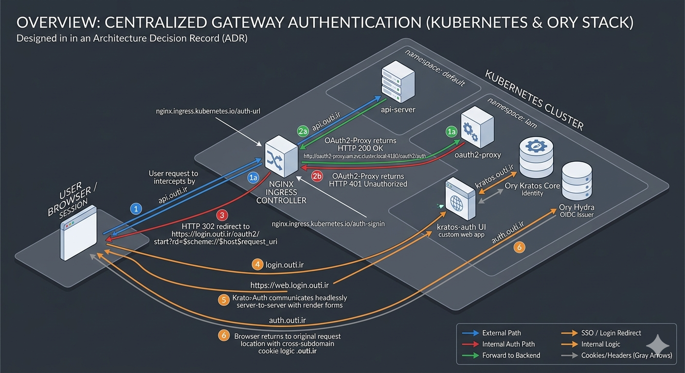

# 0000. Centralized Gateway Authentication via Nginx Ingress, OAuth2-Proxy, and Ory Stack

Date: 2026-05-31

## Status

Accepted

## Context

Our microservices architecture requires robust, centralized token-based validation for all inbound external requests targeting the core APIs (e.g., `api-server` running in the default namespace). Individual service-level implementation of JWT validation violates the principles of decoupled microservices and introduces duplicated security logic across various codebases.

Furthermore, we need a solution that enforces authentication seamlessly at the edge network layer (Ingress) before traffic is forwarded deeper into the cluster. If an incoming request lacks a valid token or presents an expired session, the system must securely intercept the traffic and seamlessly orchestrate a redirection flow toward user onboarding interfaces (Login/Registration) managed by our IAM stack, without exposing the internal verification mechanisms to the end-user.

The target infrastructure relies on the **Nginx Ingress Controller** and a centralized Identity and Access Management (IAM) workspace deployed under the `iam` namespace. The ecosystem consists of the following domains:
- **OAuth2-Proxy**: `login.outi.ir`
- **Ory Hydra** (OAuth2/OIDC Issuer): `auth.outi.ir`
- **Ory Kratos** (Identity Engine Public/Admin Core): `kratos.outi.ir`
- **Kratos-Auth** (Custom Express/Node.js UI Frontend): `web.login.outi.ir`

## Decision

We will implement **Edge-Level External Authentication** utilizing the Nginx Ingress Controller's native external authentication snippets (`auth-url` and `auth-signin`) integrated with `oauth2-proxy` and the Ory IAM ecosystem.

What is the change that we're proposing and/or doing?



### Architectural Workflow

```
                        +---------------------------------------------+
                        |               Incoming Request              |
                        +---------------------------------------------+
                                               |
                                               v
                        +---------------------------------------------+
                        |            Nginx Ingress Controller         |
                        |              (api.outi.ir/...)              |
                        +---------------------------------------------+
                                               |
                        [1] Forward Auth Check |
                            (Internal Cluster) v
                        +---------------------------------------------+
                        |                 oauth2-proxy                |
                        |      (oauth2-proxy.iam.svc.cluster.local)   |
                        +---------------------------------------------+
                                               |
                        +----------------------+----------------------+
                        |                                             |
             [2a] HTTP 200 OK (Token Valid)                 [2b] HTTP 401 Unauthorized
                        |                                        (No/Expired Token)
                        v                                             |
+---------------------------------------------+                       v
|              Nginx Ingress Forward          |      +-----------------------------------------+
|           (Direct Routing to Backend)       |      |          Nginx Ingress Intercept        |
+---------------------------------------------+      |         (Redirects User Browser)        |
                        |                            +-----------------------------------------+
                        v                                             |
+---------------------------------------------+                       | [3] 302 Redirect to Sign-in
|                 api-server                  |                       |     https://login.outi.ir/oauth2/start
|            (default namespace)              |                       v
+---------------------------------------------+      +-----------------------------------------+
                                                     |           User Browser Session          |
                                                     +-----------------------------------------+
                                                                      |
                                                                      | [4] Triggers Login Flow via
                                                                      |     https://web.login.outi.ir
                                                                      v
                                                     +-----------------------------------------+
                                                     |               kratos-auth               |
                                                     |        (Node.js Express UI Server)      |
                                                     +-----------------------------------------+
                                                                      |
                                                       +--------------+--------------+
                                                       |                             |
                                      [5a] Identity Operations       [5b] OIDC Consensus & Consent
                                                       v                             v
                                     +---------------------------+     +---------------------------+
                                     |         Ory Kratos        |     |         Ory Hydra         |
                                     |      (Identity Core)      |     |       (OIDC Issuer)       |
                                     +---------------------------+     +---------------------------+
```

1. **Edge Interception**: Every request hitting `api-server-ingress` is put on hold. Nginx forwards the request headers to `oauth2-proxy` via the internal cluster network using the endpoint `http://oauth2-proxy.iam.svc.cluster.local:4180/oauth2/auth`.
2. **Token Assessment**:
    - **Authorized Sequence**: If a valid OIDC/JWT token resides in the cookie space or the `Authorization` header, `oauth2-proxy` evaluates it against the Ory Hydra validation keys and answers with an HTTP `200 OK`. Nginx immediately terminates the auth cycle and proxies the traffic directly to the `api-server` in the default namespace.
    - **Unauthorized Sequence**: If token evaluation fails or no credentials exist, `oauth2-proxy` responds with an HTTP `401 Unauthorized`.
3. **IAM Redirection**: Upon catching the 401 status code, Nginx triggers a client-side HTTP 302 redirect toward the `auth-signin` endpoint (`https://login.outi.ir/oauth2/start?rd=$scheme://$host$request_uri`).
4. **User Authentication Interface**: The browser lands on the `oauth2-proxy` login initializing handler, which forwards the user to the `kratos-auth` platform running at `web.login.outi.ir`.
5. **Headless Coordination**: `kratos-auth` interacts headlessly server-to-server with Ory Kratos (`kratos.outi.ir`) to render native HTML login/registration grids out of Ory-provided declarative JSON blocks. After successful form completion, Ory Hydra (`auth.outi.ir`) issues a cryptographically signed cryptographic token, and the browser is returned to the original request location captured in the `$request_uri` parameter.

## Consequences

### Positive Implications (Benefits)
- **Zero-Trust Edge Security**: The internal `api-server` never receives unauthorized traffic, preventing compute resources from being wasted on invalid request payloads.
- **Architectural Decoupling**: Application code within the `api-server` stays completely lean and decoupled from identity mechanisms, cryptographical signature validation, or token lifecycle mechanics.
- **Unified Session Scope**: Setting cross-subdomain cookies on `.outi.ir` guarantees single sign-on (SSO) properties smoothly across `login`, `auth`, `kratos`, and target API microservices.
- **Centralized UI Management**: Using `kratos-auth` at `web.login.outi.ir` separates the core IAM engine logic from visual templates, enabling quick UI adjustments without patching core security deployments.

### Negative Implications & Risks
- **Additional Latency Overhead**: Every incoming API call incurs a sub-request hop to `oauth2-proxy` before routing execution. This will be mitigated by scaling the proxies horizontally and keeping local authentication caches within `oauth2-proxy`.
- **Intra-cluster Cross-Namespace Dependency**: The routing configuration creates an explicit cross-namespace dependency where the `default` namespace ingress requires the `iam` namespace service mesh to be fully functional. Tight monitoring and explicit liveness probes must be maintained over the `iam` components.